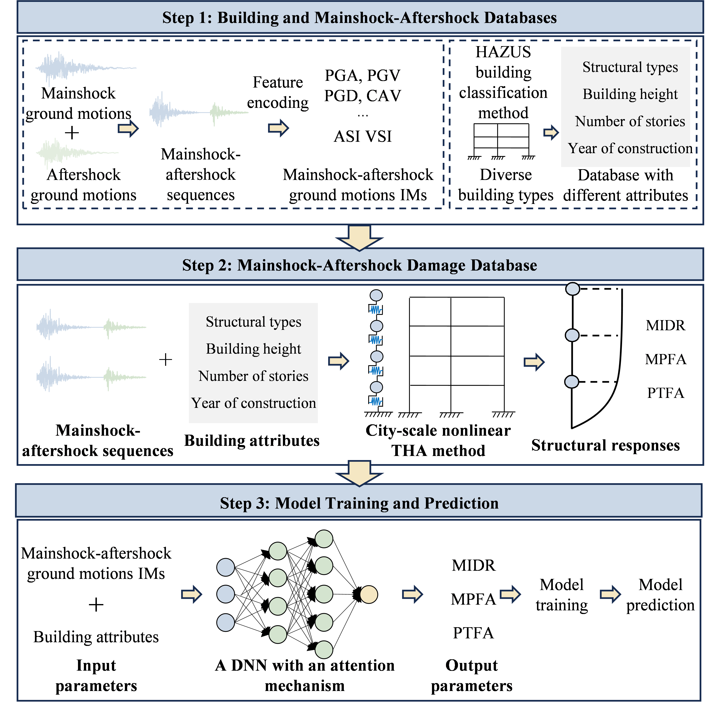

# Building Mainshock-Aftershock Damage Prediction

## Overview
This project is designed for predicting the mainshock-aftershock damage of building clusters. It leverages deep learning techniques to analyze earthquake damage patterns. The related research paper is currently under review.

## Methodology
- A deep learning-based approach is used to establish a building cluster mainshock-aftershock damage database.
- Based on the database, a predictive model is constructed for estimating the damage levels of building clusters under mainshock-aftershock sequences.
Below is the framework of the methodology used in this project:


## Quick Start

### Prerequisites
To get started, ensure you have the required Python environment configured. Refer to the `Prediction.py` script for details on the necessary dependencies.

### Prerequisites
To run this project, you need Python installed along with the following libraries (with suggested versions):

- `torch` (PyTorch) >= 1.13.0  
- `numpy` >= 1.21.0  
- `pandas` >= 1.3.0  

You can install these dependencies using the following command:
```bash 
pip install torch==1.13.0 numpy==1.21.0 pandas==1.3.0
```
Refer to the Prediction.py script for further details on required dependencies.


### Pre-trained Models
The `model` folder contains pre-trained AI models for predicting three key metrics:
- **MIDR**: Maximum Inter-story Drift Ratio.
- **MPFA**: Maximum Peak Floor Acceleration.
- **PTFA**: Peak Top Floor Acceleration.

### Input Data
- **`example_input_data.csv`**: A sample input file used for predictions. It contains data from 10 buildings with measured earthquake responses. The dataset is sourced from the **CESMD Strong Motion Database**, and we express our gratitude for their data support.
- **`Information of the measured building data.csv`**: Provides the basic attributes of the 10 buildings, along with mainshock and aftershock information.

### Prediction Script
The `Prediction.py` script demonstrates how to use the provided models to make predictions. The script:
1. Preprocesses the input data.
2. Loads the pre-trained models.
3. Outputs the prediction results to `predictions.txt`.

### Steps to Run
1. Clone the repository:
   ```bash
   git clone https://github.com/mainshock-aftershock-damage-AI.git
   cd mainshock-aftershock-damage-AI
2. Prepare the environment:
    Install the required Python libraries mentioned in Prediction.py.
3. Place your input data in the root directory (e.g., example_input_data.csv).
4. Run the prediction script:
   python Prediction.py
5. The prediction results will be saved in predictions.txt.


### File Descriptions
- **`Prediction.py`**: Script to preprocess input data, load models, and predict damage indicators.
- **`example_input_data.csv`**: Example input data for testing the model.
- **`Information of the measured building data.csv`**: Metadata of the 10 measured buildings, including mainshock and aftershock information.
- **`model/`**: Contains pre-trained models for predicting MIDR, MPFA, and PTFA.
### Acknowledgments
We appreciate the CESMD Strong Motion Database for providing the earthquake response data used in this project.

### Contact
If you have any questions or need further assistance, feel free to contact the author:
**Qingle Cheng**
Email: chengql94@163.com